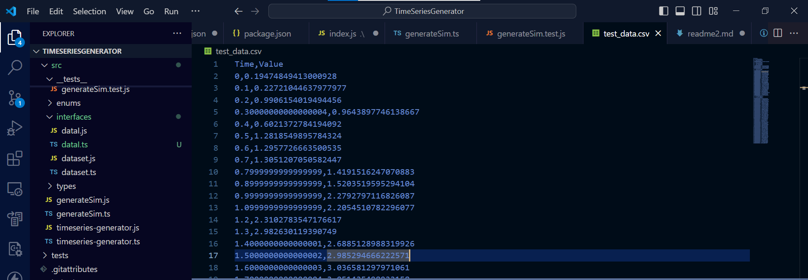

# Majic Time Series Generator (majic-ts)


majic time-series-generator is a Node.js library designed to produce sample time series data that closely resembles real-world data, incorporating elements like seasonality, trend, and noise. It aims to go beyond simple random number generation to create more meaningful datasets.



Use cases for this library include:

Creating realistic sample data for testing and development of time series analysis algorithms.
Generating synthetic data for training machine learning models that deal with time series data.
Simulating time series data for educational purposes or data visualization demonstrations.

Table of content

1. [Installation](#1-Installation)
2. [usage](#2-usage)
3. [Parameters](#3-Parameters)
4. [License](#4-license)
5. [Feedback and Contribution](#5-feedback-and-contribution)

---

## 1. Installation


### Via npm (nodejs)

`majic time-series-generator` is available via `npm`. You can install using `npm` 

```sh
# with npm
$ npm i majic-ts

```


---

## 2. usage


```js

const { TimeSeriesGenerator } = require('majic-ts/src/generateSim');

// Example usage
const generator = new TimeSeriesGenerator(0, 10, 0.1, 2, 0.5, 0.5);
generator.writeToCSV('time_series_data.csv');

```
---


## 3. Parameters

| Parameter | Description |
|-----------|-------------|
| `startTime` | The start time of the time series. |
| `endTime` | The end time of the time series. |
| `timeInterval` | The time interval between data points. |
| `seasonalityAmplitude` | The amplitude of the seasonality component. |
| `trendSlope` | The slope of the trend component. |
| `noiseLevel` | The level of noise to add to the data. |
---

## 4. License

MIT

---

## 5. Feedback and Contribution

Please open a thread for feedback, question. Feel free to create PR for contribution.

--

